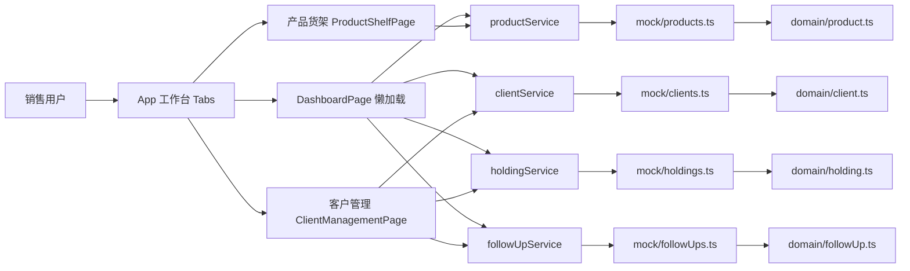

# 资管渠道销售内部工具 DESIGN

## 1. 需求分析

### 1.1 项目目标

- 帮助销售人员快速查看当前在售基金产品，并完成搜索、筛选和详情浏览
- 帮助销售人员维护客户档案、查看客户持仓、记录跟进过程
- 帮助销售团队在进入细节前先快速掌握产品结构、客户覆盖和业务状态

### 1.2 做了哪些功能

- 产品查询、筛选、详情查看
- 客户信息、持仓关系、跟进记录
- 数据概览与业务洞察

### 1.3 认为重要但因时间有限没做的功能
- 支持单点登录（SSO）
- Agent对系统数据和页面的操控能力
- bundle size 优化 P0
- 更多 Agent 边界测试

## 2. 技术选型

### 2.1 技术栈

构建工具 -- Webpack 5， 当前项目规模适中，可直接控制入口、懒加载和 chunk 切分
UI 组件库  -- 选 Ant Design，企业后台场景成熟、稳定
图表库 -- echarts + echarts-for-react 图表表达力足够，适合业务型 Dashboard
Session -- JWT + HttpOnly Cookie，让 token 不暴露给前端 JS，且支持刷新后恢复会话
输入校验 -- zod  把register/login 的约束固定在边界层
会话方案 -- JWT + HttpOnly Cookie 前端不直接持有 token，刷新后可恢复登录态
Prisma + PostgreSQL  PostgreSQL 比文件存储或 SQLite 更适合线上路径
智能查询 -- Mock Planner + 确定性执行器 通过规则匹配把自然语言映射成受限查询计划，再基于业务快照生成结构化结果   

### 2.2 架构图

## 3. AI协作日志

### 3.1 哪些环节使用了AI
- 使用CodeX辅助开发
    - AGENTS.md 
        - 放固定流程规则，约束Agent每次怎么工作。
        - 采用 requirement-first 两阶段确认流程,保证题目不会被做偏，先分析、再计划、最后编码。
    - 把“上下文”外置到仓库里，让新会话先读这些文件再继续开发。防止上下文过大膨胀。新会话时保证历史进度不会丢失。
        - 把历史信息压成 5 类，不保留原始长讨论。

### 3.2 AI帮到最多的地方
- Dashboard 图表方案与刷新失败处理
    **Prompt**
    > 基于 products / clients / holdings / followUps 四类数据，首版 Dashboard 该做哪些图表，刷新失败时页面应该如何处理才不误导销售用户

- SKILLS辅助开发前端页面，API设计
    - frontend-patterns、verification-loop、e2e-testing
    - backend-patterns、api-design、security-review

- MCP
    - functions.shell_command
    - multi_tool_use.parallel
    - update_plan

## 4. 自我复盘

### 4.1 有哪些已知但是来不及修的问题
chunk 体积优化
前端数据mock展示

### 4.2 如果是真是的企业项目，会做哪些不同的决策
邮箱密码登录作为主方案。会优先接企业 SSO
Agent 只实现了“能回答”，会更强调权限边界
