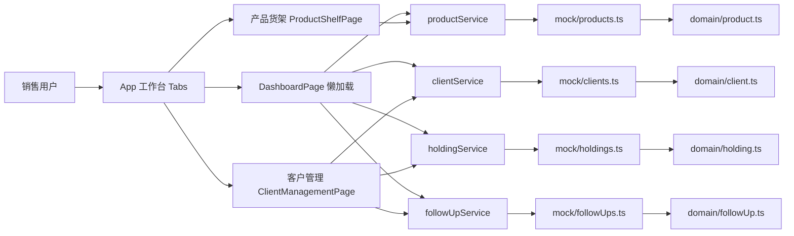
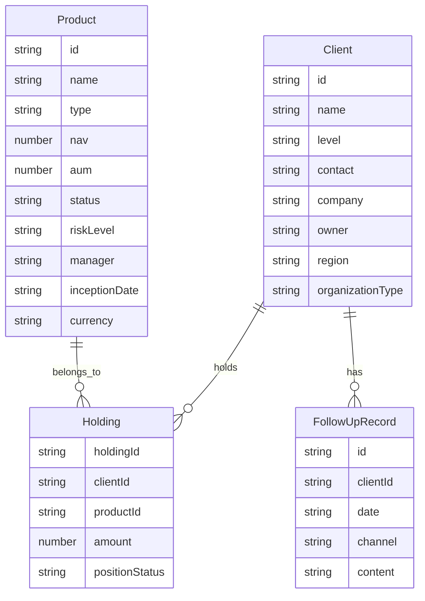
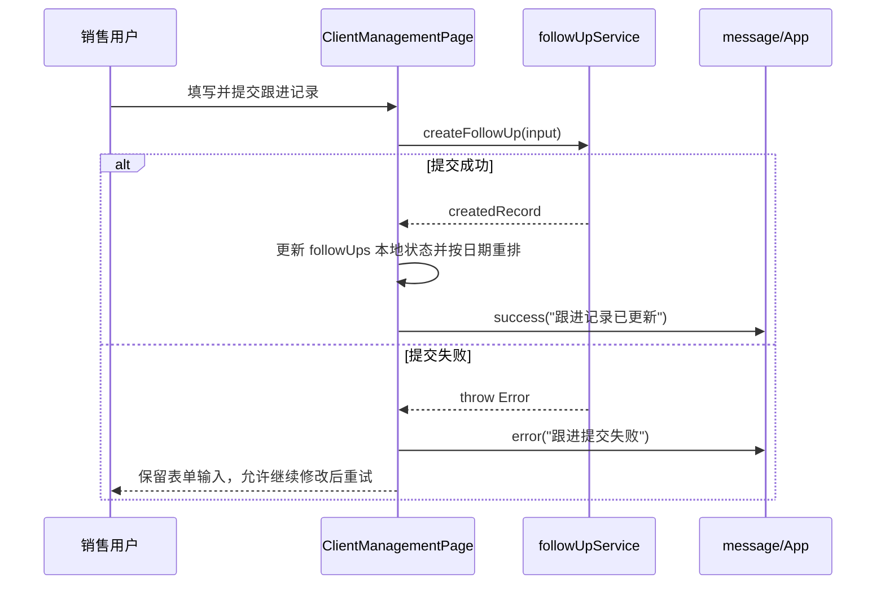
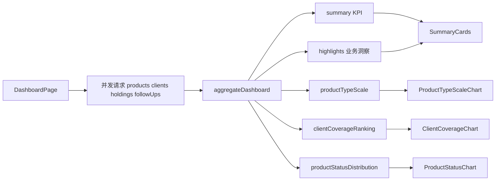

# 资管渠道销售内部工具 DESIGN

## 1. 项目概述

本项目是一个面向资管公司渠道销售团队的内部 Web Demo，目标是在有限时间内完成一个可运行、可演示、可解释的业务工作台，而不是做一个通用 CRUD 后台。

当前版本已完成 PRD 定义的 P0 范围：

- 模块一：产品货架
- 模块二：客户管理
- 模块三：数据概览 Dashboard
- Mock 异步数据获取
- 加载态、空态、异常态
- 基础响应式适配

当前版本新增的 post-P0 扩展：

- 独立认证后端服务
- 登录 / 注册 / 会话恢复 / 退出登录
- 前端 auth gate 与工作台解耦
- Prisma + PostgreSQL 认证持久化与 Vercel 部署配置
- Agent 智能查询能力：
  - 工作台内悬浮球入口
  - `/api/agent/query` 受保护查询接口
  - Mock Agent 查询规划 + 本地确定性执行

当前版本尚未完成的内容：

- `DESIGN.md` 之外的 P1 加分项仍以可选为主
- Vercel 在线 demo 尚未真正发布到公网 URL
- Dashboard 聚合逻辑与刷新状态逻辑还缺少自动化回归测试

## 2. 需求分析

### 2.1 项目目标

- 帮助销售人员快速查看当前在售基金产品，并完成搜索、筛选和详情浏览
- 帮助销售人员维护客户档案、查看客户持仓、记录跟进过程
- 帮助销售团队在进入细节前先快速掌握产品结构、客户覆盖和业务状态

### 2.2 必交付物

- 可运行 Demo
- 源码仓库
- `DESIGN.md`

### 2.3 明确约束

- 前端必须使用 React
- 数据必须通过异步方式获取，不能在组件内直接导入静态数据后渲染
- 数据规模不少于 8 个产品和 8 位客户
- 必须体现产品、客户、持仓、跟进之间的真实业务关系
- 页面需要覆盖加载态、空态、异常态，并具备基础响应式能力
- Agent 是加分项，不是 P0 及格线

### 2.4 范围取舍

本项目采用“先完成业务闭环，再考虑加分项”的策略：

- 优先完成产品货架、客户管理、Dashboard 三大核心模块
- 优先保证数据关系、异步请求、边界状态和演示路径成立
- 暂不做登录、权限、多租户、真实交易流程、复杂导出和真实 CRM 对接
- Agent 在核心链路稳定后再补充实现，并限制为“智能查询”而不是扩展主导航结构

### 2.5 当前验收结论

- P0 功能范围已完成
- 当前版本满足“可运行、可演示、可解释”的基础要求
- 剩余工作主要是完成 Vercel 公网发布，并继续补强自动化验证

## 3. 需求到实现映射

| 需求项 | 计划模块/任务 | 实现产物 | 验证方式 |
| --- | --- | --- | --- |
| 产品查询、筛选、详情查看 | 产品货架 | `src/features/productShelf/*`、`src/services/productService.ts` | `npm run build`、本地运行验证搜索/筛选/详情 |
| 客户信息、持仓关系、跟进记录 | 客户管理 | `src/features/clientManagement/*`、`src/services/clientService.ts`、`src/services/holdingService.ts`、`src/services/followUpService.ts` | `npm run build`、本地验证详情抽屉与跟进新增 |
| 数据概览与业务洞察 | Dashboard | `src/features/dashboard/*` | `npm run build`、本地验证 KPI、图表、刷新和失败状态 |
| 异步数据获取 | Mock Service 层 | `src/services/*`、`src/mock/*` | 页面首次加载、刷新、失败模拟 |
| 基础边界状态 | 三个页面统一处理 | 三个页面主文件与 `src/styles/global.css` | 加载态、空态、异常态人工验证 |
| 强制交付文档 | 设计说明整理 | `PRD.md`、`RULES.md`、`DESIGN.md`、`docs/context/*` | 文档一致性检查 |
| Agent 加分项 | 智能查询 | `server/agent/*`、`src/features/agentQuery/*`、`src/services/agentQueryService.ts` | `npm run test:server`、`npm run build`、本地 Mock Agent 查询联调 |

## 4. 技术选型

### 4.1 技术栈

| 类别 | 选型 | 原因 |
| --- | --- | --- |
| 前端框架 | React 18 | 满足题目硬性要求，适合按模块拆分工作台 |
| 语言 | TypeScript | 用领域模型约束产品、客户、持仓、跟进记录结构，提升可解释性 |
| 构建工具 | Webpack 5 | 当前项目规模适中，可直接控制入口、懒加载和 chunk 切分 |
| UI 组件库 | Ant Design 6 | 企业内部工具气质稳定，组件覆盖完整，便于快速搭建高信息密度界面 |
| 图表库 | `echarts` + `echarts-for-react` | 图表表达力足够，适合业务型 Dashboard，不必自定义绘制 |
| 数据层 | Mock 数据 + 异步 Service | 满足“异步获取”要求，并为未来切换真实后端保留边界 |
| 认证后端 | Express + TypeScript | 以最小复杂度补齐登录注册能力，不重写原有业务模块 |
| 输入校验 | `zod` | 把 register/login 的约束固定在边界层 |
| 密码哈希 | `bcryptjs` | Windows 环境依赖摩擦较小，足以支撑演示级安全边界 |
| 会话方案 | JWT + HttpOnly Cookie | 前端不直接持有 token，刷新后可恢复登录态 |
| 认证持久化 | Prisma + PostgreSQL | 支撑在线 demo 的真实账号存储，同时保留本地 file fallback |
| 智能查询 | Mock Planner + 确定性执行器 | 通过规则匹配把自然语言映射成受限查询计划，再基于业务快照生成结构化结果，稳定且可解释 |

### 4.2 为什么不是其它方案

- 没有引入路由：三个核心模块都属于同一工作台，Tabs 能更直接服务演示路径
- 没有引入全局状态库：当前状态主要是页面局部状态，跨模块共享需求不强
- 没有引入真实后端：P0 目标是先完成业务闭环和演示质量，Mock Service 足以支撑
- 没有做复杂工程栈升级：避免为了炫技增加解释成本和不必要风险

## 5. 架构设计

### 5.1 总体架构



### 5.2 目录分层

- `src/app/`：应用壳层与全局工作台入口
- `src/domain/`：业务实体定义
- `src/mock/`：演示数据
- `src/services/`：异步数据访问与失败模拟
- `src/features/`：按业务域组织的页面与组件
- `src/shared/`：格式化和通用状态展示
- `src/styles/`：全局视觉样式与响应式规则

这种组织方式的核心好处是把“数据结构”“异步获取”“页面呈现”“图表聚合”拆开，便于面试时解释职责边界。

### 5.3 实体关系



### 5.4 数据规模

当前 mock 数据规模如下：

- 产品：9 条
- 客户：8 条
- 持仓：12 条
- 跟进记录：9 条

这满足 PRD 中“至少 8 个产品和 8 位客户”的要求，也足以支撑筛选、关系查询和图表聚合。

### 5.5 Post-P0 认证与部署扩展

认证扩展没有改变原有三大业务模块的数据契约，而是作为独立边界接入：

- 后端负责 register / login / me / logout，并为受保护的 Agent 查询提供登录态校验
- 前端业务数据仍暂时沿用原有 Mock Service
- 登录成功后才进入既有的 tab 工作台
- 生产/在线 demo 走 Prisma + PostgreSQL，本地开发缺少 `DATABASE_URL` 时允许退回 file storage
- Vercel 生产形态使用 `dist/` 静态站点 + `api/[...route].ts` 托管 `/api/*`

```mermaid
flowchart LR
    U[用户] --> F[AuthPage]
    F --> A[/api/auth/register]
    F --> B[/api/auth/login]
    F --> C[/api/auth/me]
    C --> G[App Auth Gate]
    G --> W[WorkspaceShell]

    A --> S[AuthService]
    B --> S
    C --> S
    S --> R[UserRepository]
    S --> P[PasswordHasher]
    S --> T[TokenService]
    R --> J[(Prisma/PostgreSQL or file fallback)]
```

当前这条扩展线的取舍是：

- 先做 auth-only backend，而不是连业务数据一起迁到后端
- 在线 demo 走数据库存储，本地开发保留 file fallback 以降低启动成本
- 通过 `/api` 代理和 HttpOnly Cookie 解决开发期同域会话问题

### 5.6 Agent 智能查询扩展

Agent 作为 bonus feature 落地时，采用纯 Mock 方案，并且明确拆成“查询规划”与“确定性执行”两层：

- 前端只提交自然语言问题
- Mock Planner 只输出受限查询计划，不直接输出最终业务结论
- 应用代码基于既有 mock 业务数据执行查询并生成结构化结果
- 前端额外展示解析 trace，让演示能说明它如何识别意图、命中字段并应用规则

```mermaid
flowchart LR
    U[已登录用户] --> L[Agent 悬浮球]
    L --> P[AgentQueryPanel]
    P --> Q[/api/agent/query]
    Q --> A[AgentController]
    A --> S[AgentService]
    S --> B[StaticBusinessDataRepository]
    S --> C[AgentQueryPlanner]
    C --> F[Mock Planner]
    S --> E[AgentQueryExecutor]
    B --> M[src/mock/*]
    E --> R[结构化结果 + answer + trace]
    R --> P
```

当前 Agent 首版支持的查询类型：

- 客户持有哪些产品
- 某产品/某类产品被哪些客户持有
- 某客户有哪些跟进记录
- 上个月/本月新增了几个客户

当前 Agent 入口设计取舍：

- 使用悬浮球，而不是新增一级导航，避免打断原有工作台结构
- 保持 query-only 范围，不在本轮加入“辅助录入”
- 通过 `Client.createdAt` 补齐“新增客户统计”的可回答性
- 在结果区增加“解析过程”卡片，直接展示 Mock Agent 的规则命中链路

## 6. 核心模块设计

### 6.1 产品货架

#### 设计目标

- 让销售人员在少量操作内找到目标产品
- 支持组合筛选与关键词搜索
- 详情查看不打断列表上下文

#### 关键实现

- 页面入口：`src/features/productShelf/ProductShelfPage.tsx`
- 筛选器：`src/features/productShelf/components/ProductFilters.tsx`
- 列表：`src/features/productShelf/components/ProductList.tsx`
- 详情抽屉：`src/features/productShelf/components/ProductDetailPanel.tsx`
- 异步数据源：`src/services/productService.ts`

#### 设计取舍

- 产品详情使用抽屉而不是独立路由，理由是销售筛选后频繁查看多个产品，保留列表上下文更高效
- 筛选区采用 sticky 卡片，降低长列表滚动后的回找成本
- 搜索字段覆盖名称、经理、类型、状态和标签，而不是只搜产品名

#### 状态处理

- 首次加载：Skeleton
- 加载失败：错误提示 + 重试按钮
- 无产品：空态提示
- 无筛选结果：单独空态提示

### 6.2 客户管理

#### 设计目标

- 在同一上下文内展示客户信息、持仓和跟进记录
- 支持快速定位客户，并进行低摩擦跟进录入

#### 关键实现

- 页面入口：`src/features/clientManagement/ClientManagementPage.tsx`
- 客户列表：`components/ClientList.tsx`
- 详情抽屉：`components/ClientDetailDrawer.tsx`
- 持仓面板：`components/ClientHoldingsPanel.tsx`
- 跟进列表：`components/FollowUpList.tsx`
- 跟进录入：`components/FollowUpComposer.tsx`

#### 设计取舍

- 客户详情仍采用抽屉，而不是单独页面，原因与产品货架一致，强调连续查看和快速切换
- 页面同时拉取 clients/products/holdings/followUps，再在前端做 enrich，避免把关系拼装硬编码到单个组件里
- 跟进新增失败时保留用户输入，并把错误抛回表单层，这是评审体验上比“清空输入重新来”更稳妥的方案

#### 关键流程



### 6.3 Dashboard

#### 设计目标

- 在进入具体产品或客户前，先给销售一个有业务意义的全局判断入口
- 图表服务业务判断，而不是只展示“会用图表库”

#### 当前图表

- 图表一：在架产品按类型的规模占比
- 图表二：活跃客户持仓覆盖排行
- 图表三：产品状态分布

#### 关键实现

- 页面入口：`src/features/dashboard/DashboardPage.tsx`
- 聚合逻辑：`src/features/dashboard/aggregateDashboard.ts`
- 图表组件：
  - `components/ProductTypeScaleChart.tsx`
  - `components/ClientCoverageChart.tsx`
  - `components/ProductStatusChart.tsx`

#### 设计取舍

- Dashboard 使用 `lazy` 懒加载，避免图表依赖推高初始工作台首屏负担
- 聚合逻辑独立成 `aggregateDashboard.ts`，而不是把计算写进 JSX
- 刷新失败时保留上次成功快照，只展示 warning，而不是清空整个 Dashboard

#### Dashboard 数据流



#### 当前已知风险

- 聚合逻辑依赖领域常量顺序，例如 `productStatuses.slice(0, 2)` 和 `positionStatuses[0]`
- 这些假设当前没有自动化测试兜底

## 7. UI 与交互设计

### 7.1 视觉方向

- 采用企业内部工具风格，而不是营销型页面
- 以高可读性的信息面板、轻玻璃质感卡片和清晰状态色为主
- 颜色主轴为蓝绿色系，强调稳定和专业

### 7.2 响应式策略

- 常规桌面宽度下采用多列卡片布局
- `992px` 以下逐步退化为单列布局
- 抽屉在移动端切换为全宽，避免信息被挤压

### 7.3 统一交互规则

- 三个模块都提供刷新入口
- 三个模块都支持失败模拟，便于演示异常处理能力
- 三个模块都区分首次加载失败和数据为空

## 8. 关键工程判断

### 8.1 保持单工作台，不引入路由

原因：

- 三个核心模块天然属于一个内部工作台
- 演示路径更直观
- 路由切换会增加实现和解释成本，但对当前题目价值有限

结果：

- 入口集中在 `src/app/App.tsx`
- `DashboardPage` 采用懒加载

### 8.2 用 Service 层承接异步边界

原因：

- 满足题目“不能在组件内直接导入静态数据后渲染”的要求
- 后续如果切真实 API，可尽量保持页面层稳定

结果：

- 所有页面只依赖 `fetch*` / `createFollowUp`
- 失败模拟也统一收敛在 service 层

### 8.3 把关系拼装和图表聚合从 UI 中拿出去

原因：

- 客户持仓 enrich 与 dashboard aggregate 都是业务逻辑，不应散落在展示组件里
- 单独提取后更适合解释、复用和后续补测试

结果：

- 客户管理通过 `types.ts` 承载 enrich 后结构
- Dashboard 使用独立 `aggregateDashboard.ts`

### 8.4 只在触达代码时迁移 Ant Design v6 废弃 API

原因：

- 保持 diff 聚焦，避免为“顺手清理”扩大变更面
- 仍然能去掉本次触达页面的控制台告警

结果：

- 触达代码改用 `variant`、`title`、`orientation`

## 9. 验证与质量

### 9.1 已完成验证

- `npm run build` 于 2026-03-24 通过
- 本地运行时验证已覆盖：
  - Dashboard tab 可打开
  - KPI 和图表可渲染
  - 手动刷新失败后保留上次成功快照
  - 告警与错误提示文案可理解
  - 本次触达的 Ant Design 废弃用法告警已清理
- post-P0 auth 扩展已在 2026-03-26 完成以下验证：
  - `npm run test:server`
  - `npm run build`
  - 本地浏览器联调验证 register / session restore / logout
  - 游客首屏不再产生 401 控制台错误
- Agent 扩展已在 2026-03-26 完成以下验证：
  - `npm run test:server`
  - `npm run build`
  - 编译后服务 mock smoke：`POST /api/agent/query` 对“张总上个月有哪些跟进记录？”返回 `plannerSource=mock`，且时间范围正确
  - 认证后的 Agent 查询“张总持有哪些债券型产品？”返回 `trace.matchedIntent = 客户持仓查询`

### 9.2 独立审查记录

项目遵循“非平凡代码改动后必须有独立 reviewer pass”的规则。Dashboard 阶段 reviewer 的关键结论是：

- 中风险：刷新失败时隐藏了上次成功快照，容易误导用户
- 低风险：聚合逻辑和刷新状态逻辑缺少自动化回归覆盖

处理结果：

- 中风险问题已修复
- follow-up re-review 返回 `No new findings`
- 自动化测试仍是当前待办

### 9.3 当前残留问题

- 主入口 bundle 仍有体积警告
- Dashboard async vendor chunk 仍偏大
- 缺少 dashboard 聚合和 refresh-state 自动化测试
- Agent 当前仍基于前端 mock 业务数据，不是真实业务数据库查询
- 当前仓库处于“auth 走后端、业务数据走前端 mock”的混合架构
- 最新这轮 Agent 变更未执行独立 reviewer-agent pass

## 10. AI 协作日志

以下记录按本项目的实际落地结果整理，重点展示“AI 给了什么建议，我最终如何处理”，而不是简单粘贴生成内容。

### 10.1 协作记录一：整体工作台结构

**Prompt**

> 在“产品货架 + 客户管理 + Dashboard”三个模块之间，应该使用路由式多页面还是单工作台 Tabs？请给出信息架构建议和实现影响。

**AI 输出摘要**

- 建议优先使用单工作台 Tabs
- 把产品、客户、Dashboard 作为并列业务模块
- 如果图表依赖较重，可只对 Dashboard 做懒加载

**我的处理结果**

- 采纳“单工作台 Tabs”方案
- 采纳“Dashboard 懒加载”建议
- 放弃“再额外引入路由作为未来预留”的做法，因为它会增加当前题目解释成本

**落地结果**

- `src/app/App.tsx` 保持为唯一工作台入口
- `DashboardPage` 使用 `lazy` + `Suspense`

### 10.2 协作记录二：Dashboard 图表方案与刷新失败处理

**Prompt**

> 基于 products / clients / holdings / followUps 四类数据，首版 Dashboard 该做哪些图表，刷新失败时页面应该如何处理才不误导销售用户？

**AI 输出摘要**

- 建议优先做“在架产品类型规模占比”和“客户覆盖排行”
- 可以追加“产品状态分布”作为第三张图
- 刷新失败时不应清空上次成功数据，应保留快照并单独提示 warning

**我的处理结果**

- 采纳前两张核心图表
- 采纳第三张图表作为增强项并一并落地
- 采纳“保留上次成功快照”的失败处理策略
- 修改 AI 对图表说明的表达，让标题和业务价值更贴近销售场景，而不是纯统计术语

**落地结果**

- `src/features/dashboard/aggregateDashboard.ts`
- `src/features/dashboard/DashboardPage.tsx`
- reviewer 提出的刷新失败问题最终也印证了这个方向是正确的

### 10.3 协作记录三：跟进录入失败体验

**Prompt**

> 客户跟进记录提交失败时，表单应该怎样反馈，才能既告诉用户失败了，又不破坏高频录入体验？

**AI 输出摘要**

- 不要在失败后清空用户输入
- 把失败提示回传到表单上下文
- 成功时立即把新记录插入列表顶部

**我的处理结果**

- 完整采纳这组建议
- 没有继续加复杂的离线草稿或本地缓存能力，因为超出题目范围

**落地结果**

- `createFollowUp` 失败会被页面捕获并提示
- 用户输入得以保留
- 成功后记录按日期倒序立即更新

## 11. 自我复盘

### 11.1 做对了什么

- 没有把题目做成泛后台模板，而是围绕资管销售场景组织页面和字段
- 数据建模先行，先建立 Product / Client / Holding / FollowUpRecord 四类实体
- 用 Service 层和失败模拟把异步请求、错误处理和未来后端切换边界提前抽出来
- Dashboard 图表聚合没有塞进 JSX，后续可单独补测试
- 用 `docs/context/*` 管理续接状态，降低跨会话开发漂移

### 11.2 当前欠账

- `DESIGN.md` 在核心功能完成后才补写，理想状态应更早同步沉淀
- 自动化测试仍偏弱，特别是 dashboard 聚合与刷新状态
- bundle 体积还有优化空间
- Agent 目前只覆盖 query-only 范围，尚未做辅助录入、多轮澄清和真实业务库接入
- 业务接口仍未后端化，当前仍是“认证后端 + 业务 mock”混合架构

### 11.3 如果继续迭代

下一步优先级建议如下：

1. 为 `aggregateDashboard.ts` 和刷新状态补定向测试
2. 如果继续走后端线，先决定是保持 auth-only，还是把业务 mock service 逐步迁到 `/api/*`
3. 完成 Vercel 公网发布，并验证一条受保护的 Mock Agent 查询链路
4. 如果继续扩 Agent，再评估“辅助录入”或更多查询类型
5. 如果仍有时间，再做图表依赖和 chunk 体积优化

## 12. 结论

这个版本的核心价值不在于功能数量，而在于已经形成一个围绕“产品管理 + 客户管理 + 数据洞察”的完整业务闭环：

- 销售能先从 Dashboard 判断方向
- 再到产品货架定位目标产品
- 再到客户管理查看持仓并记录跟进

在题目给定的时间和范围内，这是一个更稳妥、可演示、也更容易经得起面试追问的取舍。
